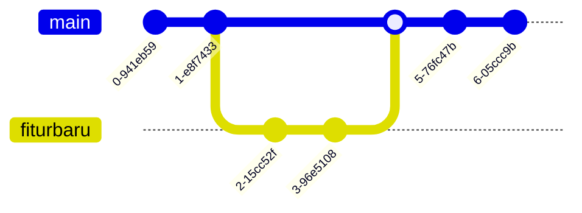

# 1. Git Demo

## 1.1 Git Init
```
+----------+       +-----------+       +------------+
|          |       |           |       |            |
| git init |  -->  | git add   |  -->  | git commit |
|          |       | [file]    |       | -m "msg"   |
+----------+       +-----------+       +------------+
```
## 1.2 Git Reverts

```
+-------------------+
| Local Repository  |
|                   |
|   +----------+    |
|   |          |    |
|   | git log  |    |
|   |          |    |
|   +----------+    |
|         |         |
|         v         |
|   +------------+  |
|   |            |  |
|   | list of    |  |
|   | commits    |  |
|   |            |  |
|   +------------+  |
|         |         |
|         v         |
|   +------------+  |
|   |            |  |
|   | git revert |  |
|   | commit_id  |  |
|   |            |  |
|   +------------+  |
|                   |
+-------------------+
```
## 1.3 Git Branch
```
+-------------------+
| Local Repository  |
|                   |
|   +----------+    |     +--------------+
|   |          |    |     |              |
|   | git init |    |     | git checkout |
|   |          |    |     | -b branch    |
|   +----------+    |     |              |
|         |         |     +--------------+
|         v         |             |
|   +-----------+   |             |
|   |           |   |             |
|   | git add   |   |             v
|   | [file]    |   |     +------------------+
|   |           |   |     |                  |
|   +-----------+   |     | git merge branch |
|         |         |     |                  |
|         v         |     +------------------+
|   +------------+  |             |
|   |            |  |             |
|   | git commit |  |             |
|   | -m "msg"   |  |             |
|   |            |  |             |
|   +------------+  |             |
|                   |             |
+-------------------+             |
                                   v
                          +-----------------+
                          | Merged Changes  |
                          +-----------------+

```

Contoh visualisasi branch



# 2. GitHub Demo

Perhatikan repositori ini melalui `Issue`, `Project Management`, dan `Pull Request`

# 3. Graphite Demo


https://graphite.dev/docs/intro-to-graphite
